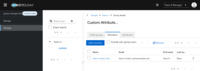

# Demonstrating Keycloak Fine-Grained Admin Permissions (FGAPv2) to Grant Group Management

## Overview

This was an exercise to demonstrate delegation of user group management.

Conclusions:

1. To get the necessary permissions granulariy, I needed a newer version of Keycloak (26.2+), with Keycloak Fine-Grained Admin Permissions version 2 (FGAPv2)

    * I didn't fully flush out the Keycloak upgrade, so I am capturing manual override steps here

2. It does look like I can restrict "team managers" to management of certain groups,
   where they can create subgroups and manage team membership.

3. It does not look like I can grant users the ability to create subgroups without also granting the ability to delete the parent group

## Keycloak Terminology

I find the terminology used in Keycloak FGAPv2 to be confusing. Here's a summary of my understanding:

* **Keycloak Policy**: Used to identify privileged actors.
  The Keycloak Policy both selects and filters actors.
  In other words, speaking in the language of AWS IAM,
  Keycloak Policies act like a combination of both the Principal and Condition fields of an AWS IAM Policy.

* **Keycloak Permission**: Maps a policy (privileged actor) to a action.
  In other words, speaking in the language of AWS IAM,
  Keycloak Permissions seem equivalent to an IAM Policy (with an embedded IAM Action).

It is also worth nothing that Keycloak started with Users, Groups, and Roles in order to assign
grant users Scopes (privileges) associated with Clients (external servies).
These permissions didn't affect management of Keycloak itself.
Keycloak FGAPv2 introduced internal resource types (Client, Groups, Roles, Users),
which seem to act like internal Scopes that affect Keycloak behavior.

## Privileges Needed for Group Management Delegation

It looks like the "team manager" users need four privileges in order to manage membership of a specific group:

1. Scope `manage-group-membership` against all users
    * We provision this via FGAPv2 below.
    * We can grant the FGAPv2 permission to actors via "policy" that points to a User, Group, or Role, but we use Group below.
2. Scopes `view`, `manage-membership` (not `manage-members`), `view-members`, and `manage` against the target group
    * We provision this via FGAPv2 below.
    * We can grant the FGAPv2 permission to actors via "policy" that points to a User, Group, or Role, but we use Group below.
3. Scopes `view-members` and `view` against any parent groups of the target group
    * We provision this via FGAPv2 below.
    * We can grant the FGAPv2 permission to actors via "policy" that points to a User, Group, or Role, but we use Group below.
4. Client Role `query-groups` from Client `realm-management` (which grants access to **Groups** section of the realm admin console)
    * This can be granted by modifying role associationas at the User level, Group level, or via User/Group-mapping through a aggregate Realm Role,
      but we do this through our "manager" Group association below.

I did verify that "scope `manage-group-membership` against all users" (#1 above) itself
does not allow the manager user to modify arbitrary group membership of all users (without also having #2 above).
I did this by granting the management user the `view-users` role of `realm-management`
(enabling the **Users** section of the admin console) and then trying to editing users' group membership.
Doing this I got a 403 for any groups that the management user did not have explicit `manage-membership` privileges to.

## Upgrading Keycloak

We need Keycloak 26.2+ to have full FGAPv2 support, but there are some complications to this upgrade that I didn't
have to time to thoroughly flush out, so I saved a temporary patch procedure here.

The CAS plugin doesn't seem to be FIP compliant, and it looks like the Keycloak image is enforcing FIPS now,
so we completely remove CAS from `docker-compose.yml`:

    ...
    # NOTE: This container is only necessary because we are installing the CAS provider for Keycloak
    # keycloak-init:
    #   hostname: "keycloak-init.${ENV_DOMAIN}"
    #   build: keycloak-init
    #   environment:
    #     # NOTE: This version must be in sync with the keycloak container
    #     KEYCLOAK_VERSION: "23.0.6"
    #     KEYCLOAK_PROVIDERS_DIR: "/keycloak-providers"
    #   volumes:
    #     - "keycloak-providers:/keycloak-providers:rw"
    #   networks:
    #     network:
    #       ipv4_address: "${ENV_IP_PREFIX}.12"
    ...
    keycloak:
    ...
    # keycloak-init:
    #   condition: service_completed_successfully
    ...

It looks like Keycloak is more strict about setting up TLS now,
so for the moment we explicitly enable non-TLS by using the `start-dev` command in `keycloak/entrypoint.sh`:

    ...
    # Launch the original entrypoint
    #/opt/keycloak/bin/kc.sh start
    /opt/keycloak/bin/kc.sh start-dev
    ...

Redeployed:

    ./authdemo-undeploy-container.sh keycloak

    # NOTE: This presumes the parent directory (compose environment name) is "auth-demo"
    sudo docker volume rm auth-demo_keycloak-data

    ./authdemo-redeploy-container.sh keycloak

It looks like the upgrade broke our proxy configs, so I had to access Keycloak through the local port:

    http://keycloak.auth-demo.docker:8080/

## Keycloak Configuration Procedures

### Create Test Realm

From **Manage realms** (left panel), clicked **Create realm**

Complete the following and clicked **Create**

* **Realm name**: `group-manage-test`

### Enable Fine-Grained Admin Permissions (FGAP)

Ensured the that the `group-manage-test` is the "current realm" in the top left

From **Realm settings** (left panel), enabled **Admin Permissions**, then clicked **Save**

### Create User Groups

Created three user groups (2 of which are nested):

* Group `team-a`
    * Group `custom`: The group that managers manage
    * Group `managers`: The group that identifies/grants managers their permissions

### Created Users

Created user `team-a-manager-user`

* **Email**: `team-a-manager-user@example.com`
* **First**: `Team A`
* **Last**: `Manager`

Created user `team-a-basic-user`

* **Email**: `team-a-basic-user@example.com`
* **First**: `Team A`
* **Last**: `Basic`

### Add Manager to Managers Group

Added `team-a-manager-user` to group `/team-a/managers`

### Create Managers Policy (Selects Managers as Actors)

From **Permissions** (left panel), selected **Policies** tab, clicked **Create policy**

Set policy type to **Group** (since we are going to using group membership to grant privileges)

Complete the following and clicked **Save**

* **Name**: `team-a_managers`
* **Groups claim**: (empty)
* **Groups**: `/team-a/managers` (members of this groups are selected for permissions associated later)
* **Logic**: `Positive`

### Create manage-group-membership Permission

From **Permissions** (left panel), selected **Permissions** tab, clicked **Create permission**

Set resource type to **Users** (since we are going to be granting privileges to affect users)

Complete the following and clicked **Save**

* **Name**: `all-users_manage-group-membership`
* **Authorization scopes**:
    * `manage-group-membership`
    * `view`
* **Enforce access to**: `All Users`
* **Policies**:
    * `team-a_managers`

### Create manage-groups Permission

From **Permissions** (left panel), selected **Permissions** tab, clicked **Create permission**

Set resource type to **Group** (since we are going to be granting privileges to affect groups)

Complete the following and clicked **Save**

* **Name**: `team-a_manage-groups`
* **Authorization scopes**:
    * `manage` (this grants ability to create subgroups but also to delete the group itself... lame)
    * `view`
    * `manage-membership` (NOT `manage-members`, which would grant the ability to edit user details)
    * `view-members`
    * `impersonate-members`
* **Enforce access to**: `Specific Groups`
    * **Groups**:
        * `/team-a/custom`
* **Policies**:
    * `team-a_managers`

### Create view-groups Permission

From **Permissions** (left panel), selected **Permissions** tab, clicked **Create permission**

Set resource type to **Group** (since we are going to be granting privileges to affect groups)

Complete the following and clicked **Save**

* **Name**: `team-a_view-groups`
* **Authorization scopes**:
    * `view`
* **Enforce access to**: `Specific Groups`
    * **Groups**:
        * `/team-a`
* **Policies**:
    * `team-a_managers`

### Testing Perimissions via "Evaluation"

NOTE: We can use the "Evaluation" tool to test user permissions wihtout actually executing them.

From **Permissions** (left panel), selected **Evalation** tab

Complete the following and clicked **Evaluate**:

* **User**: `team-a-manager-user`
* **Resource type**: `Groups`
* **Groups**: `/team-a`
* **Authorization scope**: `manage`

... which will confirm no access:

> The selected user does not have access to the selected resource(s)
> 

Repeat the action, but with this tweak:

* **Groups**: `/team-a/custom`

... which will confirm access:

> Granted scope:
> 
>     manage
> 
> Granted Permissions:
> 
>     team-a_manage-groups voted to PERMIT
> 

Repeat the action, but with this tweak:

* **Groups**: `/team-a/managers`

... which will confirm no access:

> The selected user does not have access to the selected resource(s)
> 

### Granting Managers Admin Console Access

From **Groups** (left panel), clicked group `team-a`, then `managers`, then **Role mapping** tab

Click **Assign role**, then **Client role**

Select these roles and then clicked **Assign**:

* `query-groups`

### Testing Permissions via "Impersonation"

From **Users** (left panel), click the `team-a-manager-user` user

Click **Action** (top right), then **Impersonate**, then **Impersonate**

This opens a new tab, where you are effectively logged in as the target user

Update the URL to point to the admin console:

    ...://<hostname-ip>/auth/admin/group-manage-test/console

Navigate to **Groups** and confirm the ability to add/remove the `team-a-basic-user` to group `/team-a/custom`

