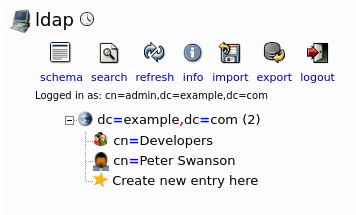

# Manual Actions in LDAP UI

## Creating Users (and Groups)

Open the LDAP UI at `https://127.0.0.1:8443/`

Login:

* User: `cn=admin,dc=example,dc=com`
* Pass: `password`

We have to have at least one group defined before we can create a user.
To define a group:

* Select `dc=example,dc=com` in the left panel, then click **Create a child entry**,
  then click **Generic: Posix Group**, and enter:
    * Group: (Group name. For example, `Developers`.)
* Click **Create Object**, then click **Commit**

To define a user:

* Select `dc=example,dc=com` in the left panel, then click **Create a child entry**,
  then click **Generic: User Account**, and enter:
    * First Name: (for example, `Peter`)
    * Last Name: (for example, `Swanson`)
    * Password: (for example, `password`)
    * GID Number: (select a Group previously defined)
* Click **Create Object**, then click **Commit**

Here is an example result:

